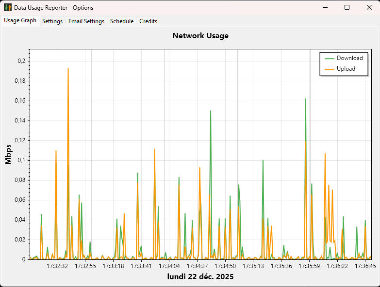
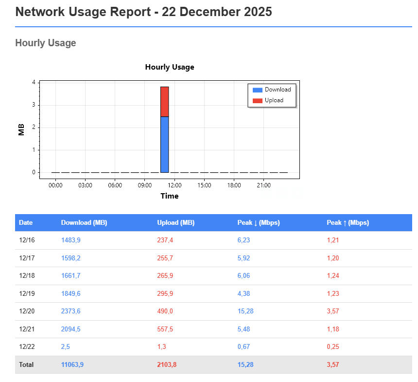
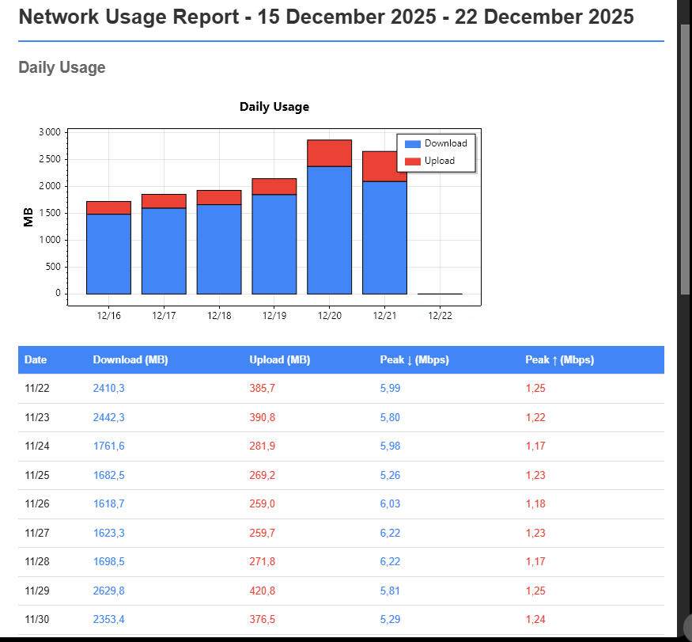

# Data Usage Reporter

A lightweight Windows application that monitors network usage and sends automated email reports with graphs and detailed statistics.

## Features

- **Real-time Monitoring**: Tracks download and upload speeds across all network adapters
- **System Tray Integration**: Runs quietly in the background with speed display overlay
- **Interactive Graph**: Visualize network usage with zoom and pan capabilities
- **Automated Email Reports**: Daily or weekly reports with embedded graphs and tables
- **Multi-language Support**: English and French interfaces
- **Data Retention**: Configurable retention period for historical data
- **Spike Filtering**: Automatically filters out anomalous speed spikes from reports

## Screenshots

### Usage Graph
Interactive graph showing download (green) and upload (orange) speeds over time. Supports zooming and panning with automatic time separators.



### Daily Email Report
Automated daily report showing hourly usage breakdown with embedded graph and weekly summary table.



### Weekly Email Report
Weekly summary with daily usage graph and detailed statistics including peak speeds.



## Requirements

- Windows 10/11
- .NET 8.0 Runtime

## Installation

1. Download the latest release from the [Releases](../../releases) page
2. Extract and run `DataUsageReporter.exe`
3. The application will start in the system tray

## Configuration

Right-click the system tray icon and select **Options** to configure:

- **Settings**: Data retention period, startup behavior
- **Email Settings**: SMTP server configuration for automated reports
- **Schedule**: Daily or weekly report delivery times

## Building from Source

```bash
# Clone the repository
git clone https://github.com/yourusername/data-usage-reporter.git
cd data-usage-reporter

# Build
dotnet build src/DataUsageReporter/DataUsageReporter.csproj -c Release

# Run
./src/DataUsageReporter/bin/Release/net8.0-windows/win-x64/DataUsageReporter.exe
```

## Technologies

- C# / .NET 8.0
- Windows Forms
- ScottPlot (graphing)
- MailKit (email)
- SQLite (data storage)

## License

MIT License
